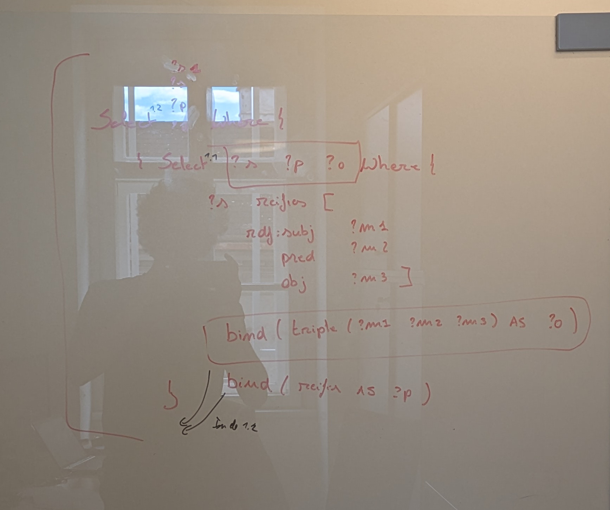

# Query Rewriting: SPARQL 1.2 over RDF 1.1

A library for rewriting SPARQL 1.2 queries into equivalent SPARQL 1.1 queries that can be executed against RDF 1.1 data sources.


## Overview

This library enables querying RDF 1.2 data (including triple terms/quoted triples) when your data is stored in an RDF 1.1 representation.
It uses SPARQL CONSTRUCT queries to define mappings between the two representations, following GAV (Global-As-View) / LAV (Local-As-View) / GLAV approaches from data integration literature.

> **Reference**: Principles of Data Integration - AnHai Doan, Alon Halevy, Zachary Ives

There is also a [working draft for RDF 1.2 interoperability](https://w3c.github.io/rdf-interop/spec/) describing standard mappings between RDF 1.1 and RDF 1.2.

## Installation

```bash
npm install query-rewriting-1-2
```

## Quick Start

```typescript
import {
  transformContextFromConstructs,
  queryTransform,
  operationTransform,
  substituteVarsThatArePreBoundToTerms,
  transformFilterFalse
} from 'query-rewriting-1-2';

// Define mappings from RDF 1.2 to RDF 1.1 representation
const mappings = [
  // Map triple terms from RDF 1.1 reification vocabulary
  `PREFIX rdf: <http://www.w3.org/1999/02/22-rdf-syntax-ns#>
   CONSTRUCT { ?t rdf:reifies <<( ?s ?p ?o )>> }
   WHERE {
     ?t rdf:reifies [
       a rdf:tripleTerm ;
       rdf:ttSubject ?s ;
       rdf:ttPredicate ?p ;
       rdf:ttObject ?o
     ]
   }`,
  // Map regular triples (excluding reification)
  `PREFIX rdf: <http://www.w3.org/1999/02/22-rdf-syntax-ns#>
   CONSTRUCT { ?s ?p ?o }
   WHERE {
     ?s ?p ?o .
     FILTER(!isTriple(?o))
     FILTER(?p != rdf:reifies)
   }`
];

// Create transformation context
const context = transformContextFromConstructs(mappings);

// Rewrite a SPARQL 1.2 query
const userQuery = `
  PREFIX rdf: <http://www.w3.org/1999/02/22-rdf-syntax-ns#>
  SELECT * WHERE {
    ?t rdf:reifies <<( :me :name ?name )>> .
    ?t :statedBy :govBE .
  }
`;

// Apply transformations
const rewrittenQuery = queryTransform(
  context,
  userQuery,
  [operationTransform, substituteVarsThatArePreBoundToTerms, transformFilterFalse]
);

console.log(rewrittenQuery);
```

## How It Works

The rewriter transforms each triple pattern in your BGP (Basic Graph Pattern) into a UNION of subselects, one for each mapping:



### Key Architecture Points

1. **Mapping Structure**: Each mapping is a SPARQL CONSTRUCT with:
   - **Head** (template): The RDF 1.2 pattern (can contain triple terms)
   - **Body** (WHERE): The equivalent RDF 1.1 pattern (must be SPARQL 1.1 compatible)

2. **Variable Clustering**: When a user query matches a mapping, variables are unified using a ClusterSolver that determines which variables must be equal and what values they're bound to.

3. **Transformation Pipeline**: Multiple optimization passes can be applied:
   - `operationTransform`: Core BGP-to-UNION rewriting
   - `substituteVarsThatArePreBoundToTerms`: Inline known variable bindings
   - `transformFilterFalse`: Remove impossible branches (FILTER FALSE)
   - `nullifyJoinOverIncompatibleBounds`: Detect incompatible join conditions
   - `pushUpBoundedFromUnion`: Hoist common bindings out of UNIONs

## Mapping Constraints

- **Single triple in head**: Each mapping must have exactly one triple in the CONSTRUCT template
- **No blank nodes in head**: Use variables instead; blank node templates are supported for skolemization
- **No BNODE() function in body**: Blank node creation in the mapping body is not allowed

## RDF 1.2 Representation Examples

### Standard RDF Reification Vocabulary

RDF 1.2 (with triple term):
```turtle
:me :name "jitse" ~ :t {| :statedBy :govBE |}
```
-- RDF 1.2 spec ->
```turtle
:me :name "jitse" .
< :me :name "jitse" ~ :t > :satatedBy :govBE
```
-- RDF 1.2 spec ->
```turtle
:me :name "jitse" .
:t rdf:reifies <<( :me :name "jitse" )>> .
:t :statedBy :govBE .
```

RDF 1.1 representation:
```turtle
:me :name "jitse" .
:t rdf:reifies _:triple1 .
:t :statedBy :govBE .

_:triple1 a rdf:tripleTerm .
_:triple1 rdf:ttSubject :me .
_:triple1 rdf:ttPredicate :name .
_:triple1 rdf:ttObject "jitse" .
```

Mapping to go back to RDF 1.2:
```sparql
PREFIX rdf: <http://www.w3.org/1999/02/22-rdf-syntax-ns#>
CONSTRUCT {
    ?t rdf:reifies <<( ?s ?p ?o )>>
} WHERE {
    ?t rdf:reifies [
        a rdf:tripleTerm ;
        rdf:ttSubject ?s ;
        rdf:ttPredicate ?p ;
        rdf:ttObject ?o ;
    ]
}
CONSTRUCT {
    ?s ?p ?o .
} WHERE {
    ?s ?p ?o .
    # Next filter is not needed since in 1.1 the function does not exist
    FILTER ( !isTripleTerm(?o)) .
    FILTER ( ?p != "rdf:reifies" && NOT EXISTS {
        ?sRoot rdf:reifies ?s .
    })
}
```
Construct to go to: (Because 2 ways, can do GLAV)
```
CONSTRUCT {
    ?t rdf:reifies [
        a rdf:tripleTerm ;
        rdf:ttSubject ?s ;
        rdf:ttPredicate ?p ;
        rdf:ttObject ?o ;
    ]
} WHERE {
    ?t rdf:reifies <<( ?s ?p ?o )>>
}
```

### Singleton Property Pattern

```turtle
:me :name "jitse" .
:me :name#1 "jitse" .
:name#1 rdf:singletonPropertyOf :name ;
        :statedBy :govBE .
```

Mapping:
```sparql
CONSTRUCT {
    ?p rdf:reifies <<( ?s ?trueProp ?o )>>
} WHERE {
    ?s ?p ?o .
    ?p rdf:singletonPropertyOf ?trueProp .
}
```

### Named Graphs Pattern
Either:
1. trust the graph has only one triple,
2. use one subject multiple times to reify many triples,
3. Annotate the graph has only one triple (could also use a count subquery?)

```turtle
:me :name "jitse" .
_:g { :me :name "jitse" }
_:g :statedBy :govBE .
```

Mapping:
```sparql
CONSTRUCT {
    ?t rdf:reifies <<( ?s ?p ?o )>> ; ?p1 ?o1 .
} WHERE {
    GRAPH ?t { ?s ?p ?o } .
    ?t ?p1 ?o1 .
    OPTIONAL { ?t a some:reificationGraph }
}
```

Mapping with check for only one triple:
```sparql
CONSTRUCT {
    ?t rdf:reifies <<( ?s ?p ?o )>> ; ?p1 ?o1 .
} WHERE {
    {
        SELECT ?t WHERE {
            GRAPH ?t { ?s ?p ?o }
        } GROUP BY (?t) having (count(*) = 1)
    }
    GRAPH ?t { ?s ?p ?o } .
    ?t ?p1 ?o1 .
}
```

### N-ary Pattern (e.g., Wikidata style)
(used by Wikidata under the [prefixes](https://www.wikidata.org/wiki/EntitySchema:E49), p(property), ps(property statement) and wdt(property direct))

```turtle
:me :name "jitse" .
:me :nameP _:temp .
_:temp :statedBy :govBE .
_:temp :namePs "jitse" .

# Made up properties...
:nameP :hasDirectProp :name .
:nameP :hasPropertyStatement ?ps .
```

Mapping:
```sparql
CONSTRUCT {
    ?rel rdf:reifies <<( ?s ?trueProp ?o )>> ; ?p1 ?o1 .
} WHERE {
    ?s ?p ?rel .
    ?rel ?p1 ?o1 ;
         ?ps ?o .

     ?p :hasDirectProp :name ;
        :hasPropertyStatement ?ps ;
}
```

## Blank Node Handling (Skolem Functions)

Since underlying RDF 1.1 datasets cannot consistently reference blank nodes across queries, this library supports four skolem types in mapping heads:

1. **TemplateIri**: Construct IRIs from variable values
2. **TemplateLiteral**: Construct typed literals from variable values
3. **TemplateBlank**: Construct consistent blank node identities
4. **TemplateQuad**: Construct triple terms

For TemplateBlank, since actual blank nodes cannot be consistently referenced, the library provides transformations to represent them as:

- [sparql extension function](https://www.w3.org/TR/sparql12-query/#extensionFunctions) `https://sparql-extension.knows.idlab.ugent.be/bnodeConsistent` that can create blank nodes matching the implementation described above.
- **Typed literals**: `internalBnodeAsSpecialLiteral()` - Uses a special datatype
- **Prefixed IRIs**: `internalBnodeAsSpecialIri()` - Uses SHA1 hashing for manageable length

Both approaches ensure "same inputs = same identity" semantics.

## SPARQL Quirks

**Empty groups produce one binding**: An empty group `{}` emits a single binding with no variables bound ([spec reference](https://www.w3.org/TR/sparql11-query/#emptyGroupPattern)).

- `SELECT * {}` → 1 binding
- `SELECT * { {} UNION {} }` → 2 bindings
- `SELECT * { FILTER(FALSE) }` → 0 bindings

This means a mapping that doesn't match uses `FILTER(FALSE)` (zero results), not an empty group.

## API Reference

### Core Functions

| Function | Description |
|----------|-------------|
| `transformContextFromConstructs(mappings)` | Create a context from CONSTRUCT query strings |
| `queryTransform(context, query, transformations)` | Rewrite a query with the given transformations |
| `operationTransform(context, operation)` | Core BGP rewriting transformation |

### Optimization Transformations

| Transformation | Description |
|----------------|-------------|
| `substituteVarsThatArePreBoundToTerms` | Inline known variable values into patterns |
| `transformFilterFalse` | Remove FILTER(FALSE) branches and simplify |
| `nullifyJoinOverIncompatibleBounds` | Replace incompatible join branches with FILTER(FALSE) |
| `pushUpBoundedFromUnion` | Hoist common bindings out of UNION branches |
| `rewriteNonRecursivePaths` | Expand property paths into BGPs |

### Blank Node Transformations

| Transformation | Description |
|----------------|-------------|
| `internalBnodeAsSpecialLiteral` | Represent blank nodes as typed literals |
| `internalBnodeAsSpecialIri` | Represent blank nodes as prefixed IRIs |

## License

See [LICENSE.txt](LICENSE.txt)
