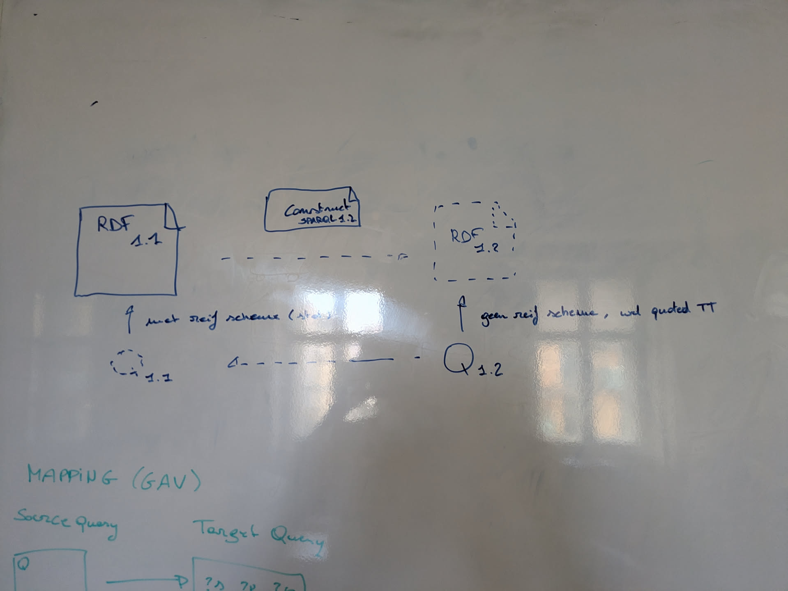

# Query Rewriting: SPARQL 1.2 over RDF 1.1

A library for rewriting SPARQL 1.2 queries into equivalent SPARQL 1.1 queries that can be executed against RDF 1.1 data sources.



## Overview

This library enables querying RDF 1.2 data (including triple terms/quoted triples) when your data is stored in an RDF 1.1 representation.
It uses SPARQL CONSTRUCT queries to define mappings between the two representations, following GAV (Global-As-View) / LAV (Local-As-View) / GLAV approaches from data integration literature.

> **Reference**: Principles of Data Integration - AnHai Doan, Alon Halevy, Zachary Ives

There is also a [working draft for RDF 1.2 interoperability](https://w3c.github.io/rdf-interop/spec/) describing standard mappings between RDF 1.1 and RDF 1.2.

## Installation

```bash
npm install query-rewriting-1-2
```

## Quick Start

```typescript
import {
  transformContextFromConstructs,
  queryTransform,
  operationTransform,
  substituteVarsThatArePreBoundToTerms,
  transformFilterFalse
} from 'query-rewriting-1-2';

// Define mappings from RDF 1.2 to RDF 1.1 representation
const mappings = [
  // Map triple terms from RDF 1.1 reification vocabulary
  `PREFIX rdf: <http://www.w3.org/1999/02/22-rdf-syntax-ns#>
   CONSTRUCT { ?t rdf:reifies <<( ?s ?p ?o )>> }
   WHERE {
     ?t rdf:reifies [
       a rdf:tripleTerm ;
       rdf:ttSubject ?s ;
       rdf:ttPredicate ?p ;
       rdf:ttObject ?o
     ]
   }`,
  // Map regular triples (excluding reification)
  `PREFIX rdf: <http://www.w3.org/1999/02/22-rdf-syntax-ns#>
   CONSTRUCT { ?s ?p ?o }
   WHERE {
     ?s ?p ?o .
     FILTER(!isTriple(?o))
     FILTER(?p != rdf:reifies)
   }`
];

// Create transformation context
const context = transformContextFromConstructs(mappings);

// Rewrite a SPARQL 1.2 query
const userQuery = `
  PREFIX rdf: <http://www.w3.org/1999/02/22-rdf-syntax-ns#>
  SELECT * WHERE {
    ?t rdf:reifies <<( :me :name ?name )>> .
    ?t :statedBy :govBE .
  }
`;

// Apply transformations
const rewrittenQuery = queryTransform(
  context,
  userQuery,
  [operationTransform, substituteVarsThatArePreBoundToTerms, transformFilterFalse]
);

console.log(rewrittenQuery);
```

## How It Works

The rewriter transforms each BGP (Basic Graph Pattern) in your query into a **UNION of JOINs**,
where every branch of the UNION represents one consistent assignment of mappers to triple patterns.

### BGP-level UNION-of-JOINs rewriting

For a BGP with **n** triple patterns and **m** mappers, the rewriter enumerates all **mⁿ**
possible mapper assignments and produces one UNION branch per assignment:

```
UNION [
  JOIN [ mapper₀(pattern₀),  mapper₀(pattern₁) ],   ← both patterns use mapper 0
  JOIN [ mapper₀(pattern₀),  mapper₁(pattern₁) ],   ← pattern 0 → mapper 0, pattern 1 → mapper 1
  JOIN [ mapper₁(pattern₀),  mapper₀(pattern₁) ],
  JOIN [ mapper₁(pattern₀),  mapper₁(pattern₁) ],   ← both patterns use mapper 1
]
```

Branches where any pattern is incompatible with its assigned mapper emit `FILTER(FALSE)`.
Downstream optimisation passes (`transformFilterFalse`, `nullifyJoinOverIncompatibleBounds`)
prune those empty branches from the final query.

### Key architecture points

1. **Mapping structure**: Each mapping is a SPARQL CONSTRUCT with:
   - **Head** (template): The RDF 1.2 pattern (may contain triple terms and template IRIs/literals)
   - **Body** (WHERE clause): The equivalent RDF 1.1 pattern (must be SPARQL 1.1 compatible)

2. **Variable clustering**: When matching a triple pattern against a mapping head, the
   `ClusterSolver` unifies variables from both sides, determining which variables must be equal
   and what concrete values they may be bound to.

3. **Transformation pipeline**: Multiple optimisation passes can be composed:
   - `operationTransform`: Core BGP-to-UNION-of-JOINs rewriting
   - `substituteVarsThatArePreBoundToTerms`: Inline known variable bindings
   - `transformFilterFalse`: Remove impossible branches (FILTER FALSE)
   - `nullifyJoinOverIncompatibleBounds`: Detect incompatible join conditions
   - `pushUpBoundedFromUnion`: Hoist common bindings out of UNIONs

### Theoretical complexity

| Dimension | Cost |
|-----------|------|
| UNION branches | O(mⁿ) worst case (all mapper×pattern pairs compatible) |
| Early pruning | A failed assignment at depth *j* emits **1** FILTER(FALSE) instead of mⁿ⁻ʲ branches |
| `rePrefixMapperForPattern` | Pre-computed once: **O(m·n·\|mapper\|)** total |
| `rewriteSinglePattern` per branch node | O(\|mapper\|) — cluster analysis + query build |
| ClusterSolver save/restore | One save+restore per BGP (O(\|state\|)); none inside the DFS |

**Practical guideline**: with **m = 2** mappers (the typical reification use-case) the branch count
is **2ⁿ**.  For most real-world queries n ≤ 5–10 so the generated UNION has at most a few hundred
branches, all pruned to a handful of meaningful results by `transformFilterFalse`.
Queries with very large BGPs (n ≫ 10) and many mappers may produce large intermediate algebra
trees; consider splitting such queries or adding selective `FILTER`s to reduce n.

### Decision-tree DFS and early pruning

Internally, `buildMappingBranches` performs a depth-first search over the mⁿ decision tree:

```
pattern₀:  try mapper₀ ──success──▶  pattern₁:  try mapper₀ ──success──▶  JOIN([sub₀₀, sub₁₀])
                         │                        try mapper₁ ──fail──────▶  FILTER(FALSE)
           try mapper₁ ──fail──────▶  FILTER(FALSE)   ← entire sub-tree pruned to 1 node
```

Key design decisions:

* **No cross-pattern solver state**: `rewriteSinglePattern` resets the `ClusterSolver` at the
  start of each call, so each pattern is matched independently against its assigned mapper.
  Cross-pattern variable equality (e.g. `?x` in two patterns) is enforced by SPARQL JOIN
  semantics via the `?uq_x` user-query variable that both `BIND` expressions write to.

* **`RewriteNoMatchError`**: The only exception class caught during the DFS.  Any other
  exception (e.g. `TypeError`) propagates immediately so genuine bugs are never silently
  converted into `FILTER(FALSE)` branches.

* **Pre-computed re-prefixed mappers**: `rePrefixMapperForPattern(mapper, i, j)` transforms
  mapper-variable names from `m{i}_` to `m{i}_{j}_`, ensuring the same mapper applied to two
  different patterns in the same JOIN branch uses disjoint variable names (preventing
  unintended equi-joins).  These re-prefixed copies are computed once — O(m·n) copies —
  before the DFS begins.

### ClusterSolver save/restore

`ClusterSolver.saveState()` and `restoreState()` snapshot the six internal maps that track
variable groups, range constraints, term bindings, and template equalities.  They are used in
exactly two places:

1. **`bgpTransform`** (outer, around the whole DFS): preserves any solver state that was
   accumulated by an outer BGP or surrounding operation *before* this BGP was entered.
   The full mⁿ DFS runs, then state is restored so the enclosing rewrite sees no side-effects.

2. *(formerly also inside `buildMappingBranches`)*: previously saved/restored state around
   each mapper attempt, which was a no-op because `rewriteSinglePattern` calls `clear()`
   anyway.  This redundant inner save/restore has been removed.

Each snapshot clones arrays shallowly (`[...v]`) and recreates `RangeSet` objects from their
entries (`new RangeSet(v)`); plain-object maps are spread-copied (`{ ...map }`).  The cloned
state objects are independent of the live maps, so save/restore is O(G + V) where G = number
of active variable groups and V = total variables — effectively O(1) immediately before any
`rewriteSinglePattern` call because `clear()` is about to empty the solver.


## Mapping Constraints

- **Single triple in head**: Each mapping must have exactly one triple in the CONSTRUCT template
- **No blank nodes in head**: Use variables instead; blank node templates are supported for skolemization
- **No BNODE() function in body**: Blank node creation in the mapping body is not allowed

## RDF 1.2 Representation Examples

### Standard RDF Reification Vocabulary

RDF 1.2 (with triple term):
```turtle
:me :name "jitse" ~ :t {| :statedBy :govBE |}
```
-- RDF 1.2 spec ->
```turtle
:me :name "jitse" .
< :me :name "jitse" ~ :t > :satatedBy :govBE
```
-- RDF 1.2 spec ->
```turtle
:me :name "jitse" .
:t rdf:reifies <<( :me :name "jitse" )>> .
:t :statedBy :govBE .
```

RDF 1.1 representation:
```turtle
:me :name "jitse" .
:t rdf:reifies _:triple1 .
:t :statedBy :govBE .

_:triple1 a rdf:tripleTerm .
_:triple1 rdf:ttSubject :me .
_:triple1 rdf:ttPredicate :name .
_:triple1 rdf:ttObject "jitse" .
```

Mapping to go back to RDF 1.2:
```sparql
PREFIX rdf: <http://www.w3.org/1999/02/22-rdf-syntax-ns#>
CONSTRUCT {
    ?t rdf:reifies <<( ?s ?p ?o )>>
} WHERE {
    ?t rdf:reifies [
        a rdf:tripleTerm ;
        rdf:ttSubject ?s ;
        rdf:ttPredicate ?p ;
        rdf:ttObject ?o ;
    ]
}
CONSTRUCT {
    ?s ?p ?o .
} WHERE {
    ?s ?p ?o .
    # Next filter is not needed since in 1.1 the function does not exist
    FILTER ( !isTripleTerm(?o)) .
    FILTER ( ?p != "rdf:reifies" && NOT EXISTS {
        ?sRoot rdf:reifies ?s .
    })
}
```
Construct to go to: (Because 2 ways, can do GLAV)
```
CONSTRUCT {
    ?t rdf:reifies [
        a rdf:tripleTerm ;
        rdf:ttSubject ?s ;
        rdf:ttPredicate ?p ;
        rdf:ttObject ?o ;
    ]
} WHERE {
    ?t rdf:reifies <<( ?s ?p ?o )>>
}
```

### Singleton Property Pattern

```turtle
:me :name "jitse" .
:me :name#1 "jitse" .
:name#1 rdf:singletonPropertyOf :name ;
        :statedBy :govBE .
```

Mapping:
```sparql
CONSTRUCT {
    ?p rdf:reifies <<( ?s ?trueProp ?o )>>
} WHERE {
    ?s ?p ?o .
    ?p rdf:singletonPropertyOf ?trueProp .
}
```

### Named Graphs Pattern
Either:
1. trust the graph has only one triple,
2. use one subject multiple times to reify many triples,
3. Annotate the graph has only one triple (could also use a count subquery?)

```turtle
:me :name "jitse" .
_:g { :me :name "jitse" }
_:g :statedBy :govBE .
```

Mapping:
```sparql
CONSTRUCT {
    ?t rdf:reifies <<( ?s ?p ?o )>> ; ?p1 ?o1 .
} WHERE {
    GRAPH ?t { ?s ?p ?o } .
    ?t ?p1 ?o1 .
    OPTIONAL { ?t a some:reificationGraph }
}
```

Mapping with check for only one triple:
```sparql
CONSTRUCT {
    ?t rdf:reifies <<( ?s ?p ?o )>> ; ?p1 ?o1 .
} WHERE {
    {
        SELECT ?t WHERE {
            GRAPH ?t { ?s ?p ?o }
        } GROUP BY (?t) having (count(*) = 1)
    }
    GRAPH ?t { ?s ?p ?o } .
    ?t ?p1 ?o1 .
}
```

### N-ary Pattern (e.g., Wikidata style)
(used by Wikidata under the [prefixes](https://www.wikidata.org/wiki/EntitySchema:E49), p(property), ps(property statement) and wdt(property direct))

```turtle
:me :name "jitse" .
:me :nameP _:temp .
_:temp :statedBy :govBE .
_:temp :namePs "jitse" .

# Made up properties...
:nameP :hasDirectProp :name .
:nameP :hasPropertyStatement ?ps .
```

Mapping:
```sparql
CONSTRUCT {
    ?rel rdf:reifies <<( ?s ?trueProp ?o )>> ; ?p1 ?o1 .
} WHERE {
    ?s ?p ?rel .
    ?rel ?p1 ?o1 ;
         ?ps ?o .

     ?p :hasDirectProp :name ;
        :hasPropertyStatement ?ps ;
}
```

## Blank Node Handling (Skolem Functions)

Since underlying RDF 1.1 datasets cannot consistently reference blank nodes across queries, this library supports four skolem types in mapping heads:

1. **TemplateIri**: Construct IRIs from variable values
2. **TemplateLiteral**: Construct typed literals from variable values
3. **TemplateBlank**: Construct consistent blank node identities
4. **TemplateQuad**: Construct triple terms

For TemplateBlank, since actual blank nodes cannot be consistently referenced, the library provides transformations to represent them as:

- [sparql extension function](https://www.w3.org/TR/sparql12-query/#extensionFunctions) `https://sparql-extension.knows.idlab.ugent.be/bnodeConsistent` that can create blank nodes matching the implementation described above.
- **Typed literals**: `internalBnodeAsSpecialLiteral()` - Uses a special datatype
- **Prefixed IRIs**: `internalBnodeAsSpecialIri()` - Uses SHA1 hashing for manageable length

Both approaches ensure "same inputs = same identity" semantics.

## SPARQL Quirks

**Empty groups produce one binding**: An empty group `{}` emits a single binding with no variables bound ([spec reference](https://www.w3.org/TR/sparql11-query/#emptyGroupPattern)).

- `SELECT * {}` → 1 binding
- `SELECT * { {} UNION {} }` → 2 bindings
- `SELECT * { FILTER(FALSE) }` → 0 bindings

This means a mapping that doesn't match uses `FILTER(FALSE)` (zero results), not an empty group.

## API Reference

### Core Functions

| Function | Description |
|----------|-------------|
| `transformContextFromConstructs(mappings)` | Create a context from CONSTRUCT query strings |
| `queryTransform(context, query, transformations)` | Rewrite a query with the given transformations |
| `operationTransform(context, operation)` | Core BGP rewriting transformation |

### Optimization Transformations

| Transformation | Description |
|----------------|-------------|
| `substituteVarsThatArePreBoundToTerms` | Inline known variable values into patterns |
| `transformFilterFalse` | Remove FILTER(FALSE) branches and simplify |
| `nullifyJoinOverIncompatibleBounds` | Replace incompatible join branches with FILTER(FALSE) |
| `pushUpBoundedFromUnion` | Hoist common bindings out of UNION branches |
| `rewriteNonRecursivePaths` | Expand property paths into BGPs |

### Blank Node Transformations

| Transformation | Description |
|----------------|-------------|
| `internalBnodeAsSpecialLiteral` | Represent blank nodes as typed literals |
| `internalBnodeAsSpecialIri` | Represent blank nodes as prefixed IRIs |

## License

Everything is [MIT licensed](LICENSE.txt) except where noted otherwise, notably,
the `/test/statics/REF-Benchmark` folder is copied from the [REF-Benchmark](https://github.com/dgraux/RDFStarObservatory) repository,
and is [Apache licenced](test/statics/REF-Benchmark/LICENSE).
